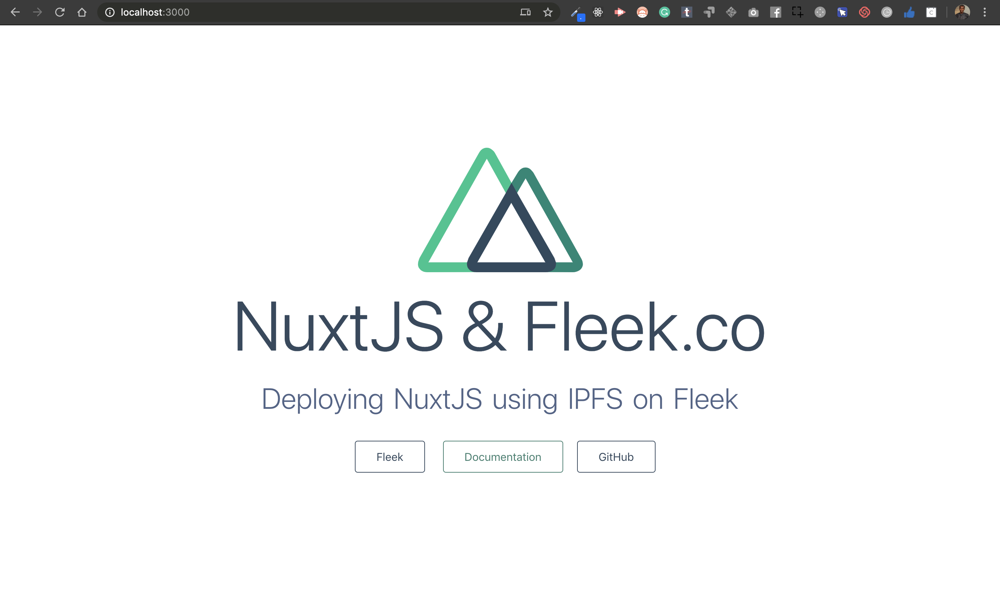

In this article, we will show you how to deploy your site built on NuxtJS and deploying using IPFS on Fleek 

```
# Table of Contents
- What is Fleek
- What is IPFS
- Starting a NuxtJS Project
- File Structure Content
- Deploying to IPFS on Fleek
- Switching name or adding a domain on Fleek
- Closing Thoughts
- Resources
```

# What is Fleek


Fleek is everything you need to build fast, modern sites & apps on IPFS. All in one seamless workflow, From local development to global deployment, Your site will not only runs on IPFS, it’s also supplemented with a global, enterprise-grade CDN, allowing for speed, scale, and performance that is superior to normal hosting. 

# What is IPFS


[IPFS](https://ipfs.io) stands for `InterPlanetary File System`, The InterPlanetary File System is a protocol and peer-to-peer network for storing and sharing data in a distributed file system. IPFS uses content-addressing to uniquely identify each file in a global namespace connecting all computing devices.

# Starting a NuxtJS Project

First step is to create a nuxt app wraped around create-nuxt-app, the name of my directory is `deploy-nuxtjs-using-ipfs-on-fleek` yours can be named whatever you like.

```
$ npx create-nuxt-app deploy-nuxtjs-using-ipfs-on-fleek

```

Once that is done you now have your repo created, all that is left is to enter into the directory using the company below

```
cd deploy-nuxtjs-using-ipfs-on-fleek
```

run the comand below to start the developement server which would create a server on `http://localhost:3000/`

```
yarn dev
```

Once that is running you would see a preview that similar to the below




# File Structure Content

## Assets
The `assets` directory is made for asstes in relations to design/style, for this project we are running on tailwind css, so in our assets/css we have `tailwind.css`

```css
/* purgecss start ignore */
@import 'tailwindcss/base';
@import 'tailwindcss/components';
/* purgecss end ignore */
@import 'tailwindcss/utilities';
```

## Pages

The `pages` directory is made up of your actual project View's and Routes, nuxt would look for files ending with a `.vue` extension and build your applications from that, in this article we have just a single file named `index.vue`

```vue
<template>
  <div class="container">
    <div>
      <logo />
      <h1 class="title">NuxtJS & <a href="https://fleek.co">Fleek.co</a></h1>
      <h2 class="subtitle">
        Deploying NuxtJS using IPFS on Fleek
      </h2>
      <div class="links">
        <a href="https://fleek.co" target="_blank" class="button--grey">
          Fleek </a
        >&nbsp;&nbsp;&nbsp;&nbsp;
        <a href="https://nuxtjs.org/" target="_blank" class="button--green">
          Documentation
        </a>
        <a
          href="https://github.com/nuxt/nuxt.js"
          target="_blank"
          class="button--grey"
        >
          GitHub
        </a>
      </div>
    </div>
  </div>
</template>

<script>
import Logo from "~/components/Logo.vue"

export default {
  components: {
    Logo,
  },
}
</script>

<style>
.container {
  margin: 0 auto;
  min-height: 100vh;
  display: flex;
  justify-content: center;
  align-items: center;
  text-align: center;
}

.title {
  font-family: "Quicksand", "Source Sans Pro", -apple-system, BlinkMacSystemFont,
    "Segoe UI", Roboto, "Helvetica Neue", Arial, sans-serif;
  display: block;
  font-weight: 300;
  font-size: 100px;
  color: #35495e;
  letter-spacing: 1px;
}

.subtitle {
  font-weight: 300;
  font-size: 42px;
  color: #526488;
  word-spacing: 5px;
  padding-bottom: 15px;
}

.links {
  padding-top: 15px;
}
</style>
```